# System Architecture: Video-AI Platform (OpenAI Sora Edition)

This document maps out the end-to-end backend orchestration, database interactions, and the multi-agent swarms utilized in the Video-AI SaaS platform, now powered by OpenAI Sora.

## 🌟 The Core Pipeline

The architecture is built around three major asynchronous phases:
1.  **Ingestion & State Creation:** Capturing user intents via React and pushing the initial job specs into the MySQL database.
2.  **AI Script Orchestration:** Disengaging the Node.js main thread to let the `AutoGen` Python microservice run a multi-agent `GroupChat`. The Groq-powered agents iterate to write the perfect cinematic "Master Shot" prompt based on the user's input constraints.
3.  **Video Generation:** Node.js takes the validated Master Prompt and ships it to OpenAI Sora for rendering. It manages a simplified asynchronous polling strategy to monitor the generation until completion.

---

## 🏗️ End-To-End Architecture Flowchart

*Below is the complete sequence diagram mapping the entire lifespan of a video generation request.*

```mermaid
sequenceDiagram
    autonumber
    
    actor Client as React Frontend (Zustand)
    participant NodeServer as Node.js Backend (Express)
    participant DB as MySQL DB (Prisma ORM)
    
    box rgb(40, 40, 60) AutoGen Python Microservice (FastAPI)
        participant UserProxy as UserProxy Agent
        participant Director as Director Agent
        participant Critic as Critic Agent
    end
    
    participant Sora as OpenAI API (Sora)

    Client->>NodeServer: POST /generate (Prompt, Avatar, Voice, Dimension)
    NodeServer->>DB: Prisma.Project.create(status: "draft")
    
    rect rgb(20, 50, 20)
    Note over NodeServer, Critic: Phase 1: AI Prompt Orchestration (Groq Llama 3)
    
    NodeServer->>UserProxy: REST POST: Request structured Master Shot prompt
    UserProxy->>Director: Direct task: Draft cinematic continuous shot based on scenes
    Director->>Critic: Submit drafted Master Prompt
    
    alt Prompt is Invalid / Hallucinated
        Critic->>Director: Reject & request fixes (e.g., Missing Avatar consistency)
        Director->>Critic: Re-submit revised Prompt
    end
    
    Critic->>UserProxy: Approve & return high-fidelity Master Prompt
    UserProxy-->>NodeServer: Return final validated Master Prompt
    end

    NodeServer->>DB: Prisma.Scene.updateMany(status: "generating")

    rect rgb(50, 20, 20)
    Note over NodeServer, Sora: Phase 2: Single-Shot Video Render (OpenAI Sora)
    
    NodeServer->>Sora: POST /video/generations (Master Prompt + Duration)
    Sora-->>NodeServer: Return Generation ID
    NodeServer->>DB: Update Project (status: "generating")
    
    loop Every 10 seconds
        NodeServer->>Sora: GET /video/generations/{id} polling
        Sora-->>NodeServer: Status (completed / failed)
    end
    
    NodeServer->>DB: Update Project & Scenes with Final Video URL
    end

    NodeServer-->>Client: 200 OK (Return Finalized Project & Video)
```

---

## 🛠️ Service Deep Dive

### 1. Main Orchestrator (Node.js & Express)
> **Location**: `/server`
> **Stack**: Node.js, Express, Prisma ORM, MySQL, OpenAI SDK.
- **Role**: This system holds the absolute source of truth. It coordinates the hand-off between AutoGen and OpenAI.
- **Simplified Pipeline**: Previous Google Veo "stretching" (looping for +7s segments) has been replaced by a single contiguous Sora request, drastically reducing complexity and credit waste.

### 2. AutoGen Swarm (Python Microservice)
> **Location**: `/server/autogen_service`
> **Stack**: Python, FastAPI, PyAutoGen, Groq.
- **Role**: Converting discrete narrative scenes into one single, highly descriptive "Oner" shot prompt for Sora.
- **Design Pattern**: It employs a **Critic-Director Multi-Agent Swarm**.
  - **The Director** specializes in cinematic syntax specifically optimized for Sora's high-fidelity parameters.
  - **The Critic** ensures the specific avatar and dimensions are locked in before submission.

### 3. State Management (MySQL / Prisma)
> **Location**: `/server/prisma/schema.prisma`
- **Role**: Persists all multi-stage transactions. 

### 4. Client Interactivity (React & Zustand)
> **Location**: `/client`
- **Role**: Submits multiplex requests to the engine and polls the state changes.

---

> [!IMPORTANT]
> **Cost Controls**
> The backend now includes a `MAX_VIDEO_DURATION` cap (currently 15s) in `openai.service.js` to prevent accidental high credit consumption during the development/testing phase.
