# System Architecture: Video-AI Platform

This document maps out the end-to-end backend orchestration, database interactions, and the multi-agent swarms utilized in the Video-AI SaaS platform.

## 🌟 The Core Pipeline

The architecture is built around three major asynchronous phases:
1.  **Ingestion & State Creation:** Capturing user intents via React and pushing the initial job specs into the MySQL database.
2.  **AI Script Orchestration:** Disengaging the Node.js main thread to let the `AutoGen` Python microservice run a multi-agent `GroupChat`. The Groq-powered agents iterate to write the perfect cinematic scene JSON array based on the user's input constraints.
3.  **Video Generation & Polling:** Node.js takes the validated JSON scenes and ships them to Google Gemini Veo for rendering. It manages a resilient, asynchronous long-polling strategy (LRO) to monitor minute-long renders without dropping the connection.

---

## 🏗️ End-To-End Architecture Flowchart

*Below is the complete sequence diagram mapping the entire lifespan of a video generation request.*

```mermaid
sequenceDiagram
    autonumber
    
    actor Client as React Frontend (Zustand)
    participant NodeServer as Node.js Backend (Express)
    participant DB as MySQL DB (Prisma ORM)
    
    box rgb(40, 40, 60) AutoGen Python Microservice (FastAPI)
        participant UserProxy as UserProxy Agent
        participant Director as Director Agent
        participant Critic as Critic Agent
    end
    
    participant Veo as Google Gemini API (Veo 3.1)

    Client->>NodeServer: POST /generate (Prompt, Avatar, Voice, Dimension)
    NodeServer->>DB: Prisma.Project.create(status: "draft")
    
    rect rgb(20, 50, 20)
    Note over NodeServer, Critic: Phase 1: AI Prompt Orchestration (Groq Llama 3)
    
    NodeServer->>UserProxy: REST POST: Request structured JSON scenes
    UserProxy->>Director: Direct task: Draft cinematic scenes based on constraints
    Director->>Critic: Submit drafted JSON array payload
    
    alt JSON is Invalid / Flawed constraints
        Critic->>Director: Reject & request fixes (e.g., Missing 16:9 Aspect Ratio)
        Director->>Critic: Re-submit revised JSON
    end
    
    Critic->>UserProxy: Approve & return clean, valid JSON array
    UserProxy-->>NodeServer: Return final validated JSON scenes
    end

    NodeServer->>DB: Prisma.Scene.createMany(Scenes Array)

    rect rgb(50, 20, 20)
    Note over NodeServer, Veo: Phase 2: Asynchronous Video Render (Google Veo)
    
    loop For each Scene in DB
        NodeServer->>Veo: POST /generateVideos payload
        Veo-->>NodeServer: Return queued Operation ID
        NodeServer->>DB: Update Scene Task ID (status: "generating")
        
        loop Every 10 seconds (Max 20 minutes)
            NodeServer->>Veo: GET getVideosOperation polling
            Veo-->>NodeServer: Status (done: false/true)
        end
        
        NodeServer->>DB: Update Scene Video URL (status: "completed")
    end
    end

    NodeServer->>DB: Prisma.Project.update(status: "completed", FinalVideoUrls)
    NodeServer-->>Client: 200 OK (Return Finalized Project Array & Videos)
```

---

## 🛠️ Service Deep Dive

### 1. Main Orchestrator (Node.js & Express)
> **Location**: `/server`
> **Stack**: Node.js, Express, Prisma ORM, MySQL.
- **Role**: This system holds the absolute source of truth. The React frontend directly communicates only with Node.js.
- **Fault Tolerance**: The `veo.service.js` holds a `pollVideoStatus` loop that attempts to grab results every 10 seconds. If the final AI generation fails due to auth or tier limits, Node.js gracefully falls back to a public test MP4 and writes that to the MySQL DB so the UI pipeline does not hard-crash.

### 2. AutoGen Swarm (Python Microservice)
> **Location**: `/server/autogen_service`
> **Stack**: Python, FastAPI, PyAutoGen, Groq.
- **Role**: Converting simple user text into complex arrays of machine-readable prompts.
- **Design Pattern**: It employs a **Critic-Director Multi-Agent Swarm**.
  - **The Director** specializes in cinematic syntax and formatting.
  - **The Critic** provides an adversarial check looking explicitly for JSON structure flaws, missing avatar constraints, or incorrectly formatted length commands. This prevents hallucinated data from crashing the Node.js server loop later.
  - Using Groq's high TPS, the multi-agent chat evaluates and resolves itself usually under 3 seconds.

### 3. State Management (MySQL / Prisma)
> **Location**: `/server/prisma/schema.prisma`
- **Role**: Persists all multi-stage transactions. If the frontend browser disconnects while Veo is taking minutes to render a video, the current state and Task IDs are safely written to the MySQL `Scene` table, meaning progress is never lost.

### 4. Client Interactivity (React & Zustand)
> **Location**: `/client`
- **Role**: Submits multiplex requests to the engine and polls the state changes. Uses Tailwind v4 and React Three Fiber to maintain an immersive experience while wait times accumulate.

---

> [!TIP]
> **Extending the Pipeline**
> To add more capabilities (e.g., adding an audio-generator), create an additional step inside the Node.js Orchestrator loop between Phase 1 and Phase 2. Ensure Prisma state schema covers any new Task ID fields.
